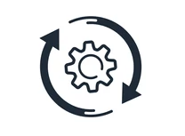

# AdaptIQ Enterprise Learning Platform



AdaptIQ is an intelligent, multi-agent Enterprise Learning Platform built for the **Microsoft Azure Foundry Hackathon**. It leverages a modern 3-tier architecture with an AI orchestration engine to generate dynamic learning paths, personalized study plans, and team-level readiness analytics for enterprise employees.

##  Architecture Overview

The system is composed of three interconnected services:

1. **Frontend (React / Vite)**: A sleek, modern dashboard for Learners and Managers to view progress, take assessments, and monitor team analytics.
2. **Gateway API (Java / Spring Boot)**: The robust middle-tier that handles JWT authentication, role-based access control (RBAC), database interactions, and asynchronous job polling.
3. **AI Engine (Python / FastAPI)**: A specialized multi-agent orchestration layer powered by Gemini 2.5 Flash, executing ReAct (Reasoning and Acting) loops across simulated Microsoft Fabric IQ and Work IQ endpoints.

---

## 🚀 Getting Started

Follow these steps to set up the environment and run the project locally on your machine.

### Prerequisites
- **Node.js** (v18+)
- **Java** (JDK 21)
- **Python** (3.11+)
- **Docker** and **Docker Compose**

---

### 1. Start Infrastructure (PostgreSQL & Redis)

The backend relies on PostgreSQL for persistent storage and Redis for rate-limiting. Start them up using Docker Compose:

```bash
cd AdaptIQ
docker-compose up -d
```

### 2. Set Up the AI Engine (Python)

The AI engine requires your Gemini API key to orchestrate the learning agents.

```bash
cd ai-engine

# Create and activate a virtual environment
python -m venv venv
source venv/bin/activate  # On Windows use: venv\Scripts\activate

# Install dependencies
pip install -r requirements.txt

# Configure environment variables
# Create a .env file and add your Google API key:
echo "GEMINI_API_KEY=your_actual_api_key_here" > .env

# Run the FastAPI server (runs on port 8000)
uvicorn app.main:app --reload
```

### 3. Set Up the Gateway API (Spring Boot)

Open a new terminal window. The Spring Boot backend uses Maven to manage dependencies and boot up.

```bash
cd gateway

# Build and run the Spring Boot application (runs on port 8080)
./mvnw clean install -DskipTests
./mvnw spring-boot:run
```
*(Note: Hibernate will automatically generate the required database tables on the first startup.)*

### 4. Set Up the Frontend (React)

Open a third terminal window to start the frontend dashboard.

```bash
cd frontend

# Install Node dependencies
npm install

# Start the Vite development server (runs on port 5173)
npm run dev
```

---

##  Usage

Once all three services are running:
1. Open your browser and navigate to `http://localhost:5173`
2. Create a new account. By default, accounts are created with the **LEARNER** role. You must meet the strict password requirements (Min 8 chars, 1 uppercase, 1 number, 1 special character).
3. Generate a personalized learning path, take an assessment, or explore the mock Manager dashboard.

## Built With
* **Frontend**: React, React Router, Vite, Lucide Icons
* **Backend**: Java 21, Spring Boot, Spring Security (JWT), Hibernate/JPA
* **AI Engine**: Python, FastAPI, Google Gemini 2.5 Flash
* **Databases**: PostgreSQL, Redis


